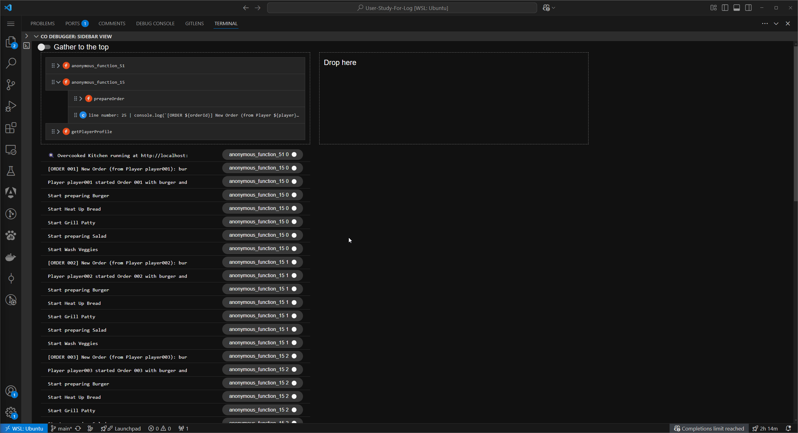
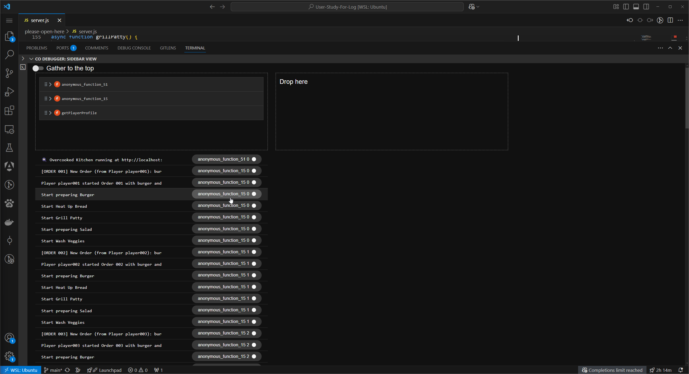
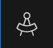

### 🗂️ Intro to Logiverse

> “Let me walk you through how to use **Logiverse**, a VSCode extension that helps developers organize and contextualize their `console.log` outputs more effectively.”

---

### 🔁 Log Timeline View

> “When Logiverse first opens, it presents the log outputs in **temporal order**—the same sequence they appeared during program execution. You’ll see log messages printed by the server as the application runs.”

---

### 🌳 Function Tree (Top of the View)

> “At the top of the panel, you’ll see a tree view showing a simplified call graph of your program. But to reduce clutter, Logiverse only includes functions that actually contain console.log statements. This helps you focus only on the parts of the code that generated output.”

> “Each tree node represents a function that logged something during runtime. You can click on a node to expand it and inspect the logs or subsequent function calls inside.”

---

### ✋ Drag & Drop to Create Custom Views

> “You can **drag** any function or log statement to the **top of the list** to create a new list. This isolates all logs associated with that function or that specific log statement. It’s a quick way to focus on just one part of the code or isolate a specific execution path.”


---

### 🔖 Labels and Filtering

> “Each log message is tagged with a **label**, typically the function name and call index.  
Clicking on a label will **filter the logs** to show only those related to that specific function call.”

> “For example, if you want to focus on the first call to `anonymous_function_15`, the one that received `Order 001`, you can click on its label.  
Logiverse will then split out the logs for just that function call—making it much easier to follow what happened in that call from start to finish.”



Here's a self-contained **Markdown-formatted self-guided tutorial** for participants to get started with your prototype tool and explore logs generated from the `ad-hoc-async` project:

---

## 🧪 Self-Guided Tutorial: Exploring Logs with the Prototype Tool

Welcome! In this tutorial, you’ll set up and run a simulated server, send test requests, and use our prototype tool to explore and reason about the behavior captured in log output.

This guide will take approximately **10 minutes**.

---

## Step 1: Configurate Logiverse (or currently CO DEBUGGER: SIDEBAR VIEW)
Please search in vscode marketplace for Logiverse and click install. After the installation, please check the sidebar, you should be able to see a new icon.



Please drag the icon and place it side-by-side with terminal for the better user experience.

## Step 2: Run the example1.js and example2.js

Open **Terminal 1**, navigate to the `please-open-here`, and run:

```bash
npm run example1
```

or 

```bash
npm run example2
```


This compiles and runs the example1.js in playground folder into a Logiverse-compatible version. Please examine the code in example1 or example 2 and observe the output in Logiverse and drag and drop the interface to learn its feature. You could refer back to the youtube video for all the features. Once you are ready, please tell the moderators for the next task.

---